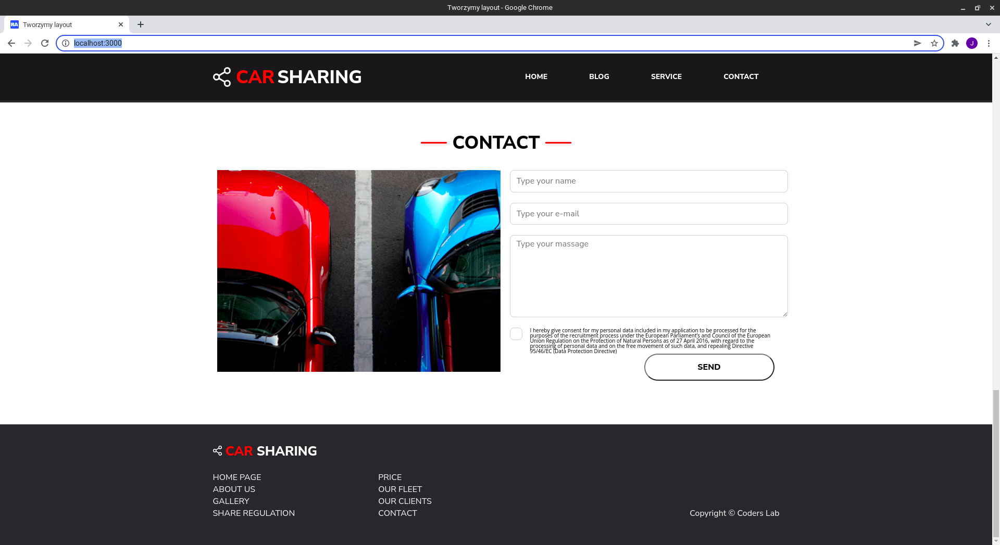

# Car-sharing
> Non-responsive web design started with CSS styling, then converted to SCSS in learning process.

> Live demo [_here_](https://jacpolanski.github.io/Car_Sharing/)

## Table of Contents
* [General Info](#general-information)
* [Technologies Used](#technologies-used)
* [Screenshots](#screenshots)
* [Setup](#setup)
* [Project Status](#project-status)
* [Room for Improvement](#room-for-improvement)
* [Contact](#contact)

## General Information
- Project created at CodersLab bootcamp
- Purpose was to learn how to simply build layouts
- Later project styling rewritten to SCSS

## Technologies Used
- HTML
- SCSS

## Screenshots

## Setup
- download or clone repository / `git clone repo_address`
- install dependencies / `npm install`
- start by `gulp`

## Project Status
Project is: _no longer being worked on_. Assumed learning taks completed.

## Room for Improvement
Plenty :)

## Contact
Created by [_jac.polanski_](https://www.linkedin.com/in/polanski-jacek/) - feel free to contact me!
